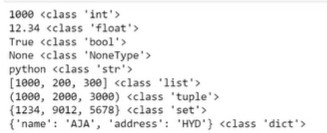
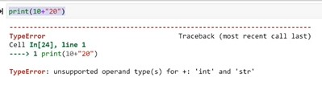
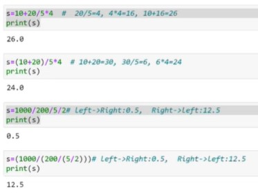
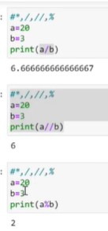
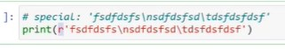
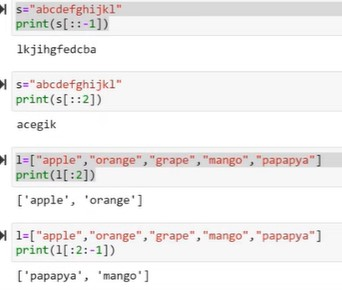

## Python:

* It is a high-level, general purpose programming language.
* It is dynamically typed and garbade collected.


Ex:
```
a=20     # here 'a' is reference  and '20' is object
b=30
c=a+b
print(c)
```
### Variable Assignment:

* Python creates an object for the value and stores it in memory.
* The variable name is the bound to the memory location where the object resides.

### Retrieving Values:

* When variable is accessed, python retrives the object from memory location.

### Printing Values:

* The 'print' function converts the value to a string and sends it to the o/p stream.

### Memory Management:

* Python handles memory management allocation and deallocation automatically, ensuring efficient use of resources.

### Compiler:

* Translates the entire source code into machine code before the program runs.
* The compiler then saves the object code as a file and the CPU's executes it directly.

### Interpreter:

* It translates the code line-by-line, without saving it.

### Operating System & Threads:

* An OS is a software that controls and runs everathing on our computer.
* Python VM will take procresses, VM will interact with processer(Hardware(RAM))
* **`Operating System`** ->  Process creates has **`two threads`**.
    * **`Main Thread`** - It will access space in RAM. It creates a stack in RAM with ID/Value/Reference/Type in Heap
    * **`Garbage Collector Thread`** - It deletes unused objects in RAM

### Internal Memory Management:

* It is also know as Integer Management Internally
* (0-256) will load object in memory consider same ID's
* After 256, the Objects in mmemory consider different ID's

### Object:

* Object is specifications which consistes of ID, Value, Reference count and Type.

    `Object: ID / Reference Count / Value / Type`

* One object can have many references.
* One references can haave only one object.
* While running -> if refrence object count '0' -> It is unused objects -> So garbage collector removes unused objects in RAM.
* Suppose, object is '3000' > given to reference > then it will create new object

### Process:

* It is a task allocating and runs in computer.

### HARD Disk:

* Entire source code stord in HDD
    ```py
    a=20     # here 'a' is reference  and '20' is object
    b=30
    c=a+b
    print(c)
    ```
* Python file Execution has 2 phases:

    1) Compilation (source code > complie convert > machine(a.exe) readable code)
        * Complilation(first.pyc) > you need python VM to run the first.pyc file 
        * Byte code which only understand python VM
    2) Execution:
        * Directly deploy program output


### References and the Rules:

**Rules**:

1) Reference name should be userfriendly. To understand the code for future reference by watching code. 
2) Space not allowed in Reference name.
3) Special symbol only allowed is underscore( _ ) . No other special symbols are not allowed in reference name.
4) Reference name are case sensitive.
5) Every organization follow their own certain rules for reference names and we need to follow them.
6) **`Constant reference Rules in Python which is not restricted`**:
    * All references (variables, constant/hard coded value, module,function, class)
        * **Variable**: It should be always in small letters
        * **Constant/hard coded value**: It shound be always in Caplital letters. 
        (Ex: a = 1000 #hardcoded value)
        * **Function**: If the name has more than one word: we can follow camelcase
        (Ex: addTwoNumbers)
        * **Class**: It follow capital case like (CustomerPayments)
7) Can we use numbers in reference names ?
    * We can use number but it can't be begining of the name.
    * Using number is not recommandable.
    * In-Built words can't use as a reference name.
8) What do yo mean by in-built word. reserved ?

    

     ```py
    apple = 'ORANGE'
    print(apple)
    ```
    * `Explanation`: Here for 'ORANGE' object,   is assigned to 'apple' reference.

    * print(true) # will get 'NameError'
    * print(True) # when you started python process, it will load some objects into memory(RAM)

        

    * Whenever we give value , it can be override. But Python have pre-defined values(reserved word) cannot be override user defied alues can be overwrite.

    * **`Reserved Words`**: 

        

        * So above keywords should not be use for variable reference name.

### Operators:

1) **Arthemathic Operators** ( + , - , / , // , % , * , ** )
2) **Boolean Operators** (==,!=,>,<,>=,<=,IS,IN,NOT, AND,OR)
3) **Bitwise Operators** ( & , ^(cap symbol) , |(type symbol)) 

* For String datatype : 'IN' operator always check for substring only not the latest individually. It will use when object is 'iterable' . it will work

* **`AND OR Tables:`**

`AND Table:`

```
TRUE AND TRUE = TRUE
TRUE AND FALSE = FALSE
FALSE AND TRUE = FALSE
FALSE AND FALSE = FALSE
```

`OR Table:`

```
TRUE OR TRUE = TRUE
TRUE OR FALSE = TRUE
FALSE OR TRUE = TRUE
FALSE OR FALSE = FALSE
```

`XOR Table:`

```
TRUE XOR TRUE = FALSE
TRUE XOR FALSE = TRUE
FALSE XOR TRUE = TRUE
FALSE XOR FALSE = TRUE
```
EX: (10>2) != ('hyd' in 'hyderabad')
o/p: False
  
### Data Types:

* We need to know how arthematic operators will act on different data types and its syntax:
             
    1) Integer    ----  `int`
    2) Float      ----  `float`
    3) Boolean    ----  `bool`
    4) NoneType   ----  `NoneType`
    5) String     ----  `str`
    6) List       ----  `list`
    7) Tuple      ----  `tuple`
    8) Set        ----  `set`  (set will not follow index and order)
    9) Dictionary ----  `dict`
    10) Complex   ----  `comp`

Ex:

```py
a=1000            # integer
print(a, type(a))  
a=12.34           # float
print(a, type(a))
a=True            # boolean
print(a, type(a))
a=None            # none type
print(a, type(a))
a="python"         # string  
print(a, type(a))
a=[1000,2000,3000]  # list  
print(a, type(a))
a=(1000,2000,3000)   # tuple  
print(a, type(a))
a={1234,5678,9012}   # set    
print(a, type(a)) 
a={"name":"AJA","address":"HYD"} # dictionary: is consists of element with key and value parts   {'key':'value','key':'value'} 
print(a, type(a))
a=1+2j
print(a, type(a))  # complex
```
**Output**:



#### What is summation and concatenation ?

* The sum () function is used to add the numerical values, whereas the join () function concatenates the items of the iterables



```py
print(str(10)+'20') # need to convert into string to aviod 'Concatination error'
```
#### Lexical Comparison

```py
print((1,2,3,4)<(10,-20,-30,-40))  #1<10 : True
```
#### Sub sets and Super sets

* If set A contains set B, then A is said to be the superset of B.
 
* If set A is contained in set B then A is said to be the subset of B

```py
a={1,2,3,4}
b={2,3}

{1,2,3,4} < {2,3}
```
### Expression Evaluation:



* Python will work from `left to right`

### Memory 

### Type casting:

* Casting, also known as type conversion, is a process that converts a variable's data type into another data type.
* These conversions can be **`implicit`** (automatically interpreted) or **`explicit`** (using built-in functions).

#### Type Conversions:



* Using `for loop` if we can able to iterate, than it is iterable object.

#### Number System(NS):

1) `Binary NS `  : 2 (0,1)
2) `Octo NS `    : 8(0,1,2,3,4,5,6,7)
3) `Decimal NS`  : 10 (0,1,2,3,4,5,6,7,8,9)
4) `Hexa Decimal`: 16 (0,1,2,3,4,5,6,7,8,9,a,b,c,d,e,f)

* int() base must be > = 2 and < = 306, or 0

#### Power Operations

* For 2 square, we use symbol ' ** ' 
    
    **ex**: 2 ** 2 = 4

    * another way,
        ```py
        import math
        math.sqrt(4)
        ```
#### Conversions of charater to ASCII

Ex: 
```py
ord('a')  # O/P: 97 (converted to number)

chr(97) #  O/P: 'a' (converted to letter)

chr(ord('a')-32)  # 'A' (converted small to capital letter)

chr(ord('A')+32)  # 'a' (converted capital to small letter)
```

### Input:

* This input function is used to derive input from the user

### Print Statement:

* This is used to print the desired message on a device screen

### String Formation:

* If we want to collect all details and need to give in the form of statement.
* In string formation , we have template string/'f' string.
* **Format specifiers**: 
    1) %s --> Percentile Separation 
    2) %d --> Integer Convertor
    3) %r -->
    4) %f --> Float conversion

* Example for **`%S`**:   
    ```py
    cost = 123.45668786768
    print('The product cost : %s', cost)

    # Instead of comma(,) we used percentile(%) to separate the hardcoded string object on the float object. Because of this percentile(%) python will recognize the format specifier(%s), so cost value will be replaced '%s'

    print('The product cost : %s'%cost)

    # convert value to float

    print('The product cost : %f'%cost)
    # convert value to int 

    print('The product cost : %d'%cost)
    ```
* We have **`Special symbols`**:
    * `\n ` (separate into different lines )
    * `\t ` (it use to provide space. By default it gives 4 spaces)
    *  To say python not to treat special symbols for actual special symbols(\n and \t) we use double slash (\\n and \\t)
    * **Ex**:

        ```py
        print('sdadf\nadsf\tcrevfv') # in python it \n and \t will consider special symbols
        print('sdadf\\nadsf\\tcrevfv') # # in python it \\n and \\t will not consider special symbols
        ``` 
    * `Raw string`: if we use 'r' before string like below
        
        * In raw string, theie is no identity for special symbols.
        
* In print statement, if we are trying to do `string object` and `integer reference`, we can't do that  it throw type error. So we can't do that operation in python  

Ex:

```py
print("This is product"+a)  # we get type error

print("This is product"+str(a)) # we need to convert to string

print("This prpduct: {cost: 2f}")  # for float if we need only few digits after point 
```

### Code Review:

* It is process where developers review code to ensure its high quality, meet standards, and it is ready to merge into the codebase.

### Boolean Function

* Iterable object means sequences which can be either list/set/dict datatype. 
* For integer and float
    * If we given '0' > bool will consider as False.
    * If we given '1' > bool will consider as True.
    * If we given bool(0,0) also False


### Conditional statements:

* Ex1:
    ```py
    print('started')
    a=1000
    b=2000
    if False:  #if this statement false 
        print('a is big')
    else:
        print('b is big')
    print('ended')
    ```
* Ex2: 
    ```py
    value = input('enter a value')
    print(len(value))
    print(type(value))
    ```
* Ex3:
    ```py
    #value, value2: value1+value2. 
    value1 = input('enter value1: ') 
    value2 = input('enter value2: ')
    if value1 == '': # to make sure value is provided by user without missing/living blank
        value1 = 0
    else:
        value1 = float(value1) 
    if value2 == '': # to make sure value is provided by user without missing/living blank
        value2 = 0
    else:
        value2 = float(value2)
    print(value1+value2) 
    ```
#### **`(option) Opt Datatype string:`**

* If we use opt datatype string we need to compare with string only

* Ex:

    ```py
    a=100
    b=200
    print('1.add\n2.sub\n3.mul')
    opt = input('Enter an option')
    if opt == '1':
        print(a+b)
    elif opt == '2':
        print(a-b)
    elif opt == '3':
        print(a/b)
    else:
        print('Enter valid option')
    print('Thank you!')
    ```

### Looping: 

* Any task in program, multiple times repeating purpose. we will kepp that code in loop and reuse that code again and again.
* One particular block of code, we can use in multiple files bye keeping that code in function  and resue it.

* Suppose we have list how to do process of looping.

* so for dynamic generating list or set like below we can't able to write program due to it gets tricky

```py
numbers = [10,23,35,46,38,69]
for num in numbers: # for > 'keyword', in > 'operator' , 'num' > user-defined name, numbers > 'sequence values in list' like num=10, num=23
    print('Hello')
    print(num)
print('hi')
```

### Slicing: 

* In slicing we use colon ':'. For getting multiple values at a time in given string/list/tuple we use `Slicing`

```py
s='abcdefghijkl'
print(s[0:3]) # It will give 0th index to 2nd index and 3rd index will be excluded

print(s[5:13]) #default step value: 1
```
* The above one is slicing which we used (:)'slicing' and below one is 'indexing'
```py
print(s[0],s[1],s[2],s[3])
```
* For One Character we have two indexes, one is +VE index and second is -VE index 
* +VE Index is always 'Zero'. -VE index we need to calculate.
* In slicing we won't get 'index out of range' error
* In slicing, towards left or right which need to go, will decide the `step value` sign '+' or '-'

* Steps to follow in slicing:
    1) Direction
    2) Range possibility
    3) Pick up the elements

* Ex: 
```py
s='abcdefghijkl' 
print(s[2:10]) # default step value: +1 ...  which means starts from index '2'.
# starts at 'c' and In slicing, towards left or right which need to go, will decide the `step value` sign '+' or '-'. So it go towards Right side


print(s[2:10:-1]) # Here, 2 = Start index[2] , 10 = Stop , -1 = Step value. So it go towards Right side
```
* Slicing will use in numpy, panda. In 6 datatypes slicing will be used.



