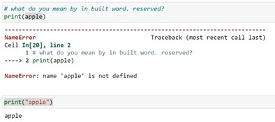
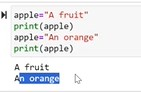
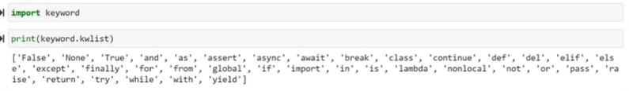

## Python:

* It is a high-level, general purpose programming language.
* It is dynamically typed and garbade collected.


Ex:
```
a=20     # here 'a' is reference  and '20' is object
b=30
c=a+b
print(c)
```
### Variable Assignment:

* Python creates an object for the value and stores it in memory.
* The variable name is the bound to the memory location where the object resides.

### Retrieving Values:

* When variable is accessed, python retrives the object from memory location.

### Printing Values:

* The 'print' function converts the value to a string and sends it to the o/p stream.

### Memory Management:

* Python handles memory management allocation and deallocation automatically, ensuring efficient use of resources.

### Compiler:

* Translates the entire source code into machine code before the program runs.
* The compiler then saves the object code as a file and the CPU's executes it directly.

### Interpreter:

* It translates the code line-by-line, without saving it.

### Operating System & Threads:

* An OS is a software that controls and runs everathing on our computer.
* Python VM will take procresses, VM will interact with processer(Hardware(RAM))
* **`Operating System`** ->  Process creates has **`two threads`**.
    * **`Main Thread`** - It will access space in RAM. It creates a stack in RAM with ID/Value/Reference/Type in Heap
    * **`Garbage Collector Thread`** - It deletes unused objects in RAM

### Internal Memory Management:

* It is also know as Integer Management Internally
* (0-256) will load object in memory consider same ID's
* After 256, the Objects in mmemory consider different ID's

### Object:

* Object is specifications which consistes of ID, Value, Reference count and Type.

    `Object: ID / Reference Count / Value / Type`

* One object can have many references.
* One references can haave only one object.
* While running -> if refrence object count '0' -> It is unused objects -> So garbage collector removes unused objects in RAM.
* Suppose, object is '3000' > given to reference > then it will create new object

### Process:

* It is a task allocating and runs in computer.

### HARD Disk:

* Entire source code stord in HDD
    ```py
    a=20     # here 'a' is reference  and '20' is object
    b=30
    c=a+b
    print(c)
    ```
* Python file Execution has 2 phases:

    1) Compilation (source code > complie convert > machine(a.exe) readable code)
        * Complilation(first.pyc) > you need python VM to run the first.pyc file 
        * Byte code which only understand python VM
    2) Execution:
        * Directly deploy program output


### References and the Rules:

**Rules**:

1) Reference name should be userfriendly. To understand the code for future reference by watching code. 
2) Space not allowed in Reference name.
3) Special symbol only allowed is underscore( _ ) . No ther special symbols are not allowed in reference name.
4) Reference name are case sensitive.
5) Every organization follow their own certain rules for reference names and we need to follow them.
6) `Constant reference Rules in Python which is not restricted`:
    * All references (variables, constant/hard coded value, module,function, class)
        * **Variable**: It should be always in small letters
        * **Constant/hard coded value**: It shound be always in Caplital letters. 
        (Ex: a = 1000 #hardcoded value)
        * **Function**: If the name has more than one word: we can follow camelcase
        (Ex: addTwoNumbers)
        * **Class**: It follow capital case like (CustomerPayments)
7) Can we use numbers in reference names ?
    * We can use number but it can't be begining of the name.
    * Using number is not recommandable.
    * In-Built words can't use as a reference name.
8) What do yo mean by in-built word. reserved ?

    

     ```py
    apple = 'ORANGE'
    print(apple)
    ```
    * `Explanation`: Here for 'ORANGE' object,   is assigned to 'apple' reference.

    * print(true) # will get 'NameError'
    * print(True) # when you started python process, it will load some objects into memory(RAM)

        

    * Whenever we give value , it can be override. But Python have pre-defined values(reserved word) cannot be override user defied alues can be overwrite.

    * **`Reserved Words`**: 
    
        

    * So above keywords should not be use for variable reference name.

### Operators:

1) **Arthemathic Operators** ( + , - , / , // , % , * , ** )
2) **Boolean Operators** (==,!=,>,<,>=,<=,IS,IS,NOT, AND,OR)
3) **Bitwise Operators** ( & , ^(cap symbol) , |(type symbol)) 

### Data Types:

* We need to know how arthematic operators will act on different data types and its syntax:
             
    1) Integer    ----  `int`
    2) Float      ----  `float`
    3) Boolean    ----  `bool`
    4) NoneType   ----  `NoneType`
    5) String     ----  `str`
    6) List       ----  `list`
    7) Tuple      ----  `tuple`
    8) Set        ----  `set`
    9) Dictionary ----  `dict`
    10) Complex   ----  `comp`

Ex:

```py
a=1000            # integer
print(a, type(a))  
a=12.34           # float
print(a, type(a))
a=True            # boolean
print(a, type(a))
a=None            # none type
print(a, type(a))
a="python"         # string  
print(a, type(a))
a=[1000,2000,3000]  # list  
print(a, type(a))
a=(1000,2000,3000)   # tuple  
print(a, type(a))
a={1234,5678,9012}   # set    
print(a, type(a)) 
a={"name":"AJA","address":"HYD"} # dictionary: is consists of element with key and value parts   {'key':'value','key':'value'} 
print(a, type(a))
```
**Output**:


### Memory 

### Type casting:

* Casting, also known as type conversion, is a process that converts a variable's data type into another data type.
* These conversions can be **`implicit`** (automatically interpreted) or **`explicit`** (using built-in functions).
