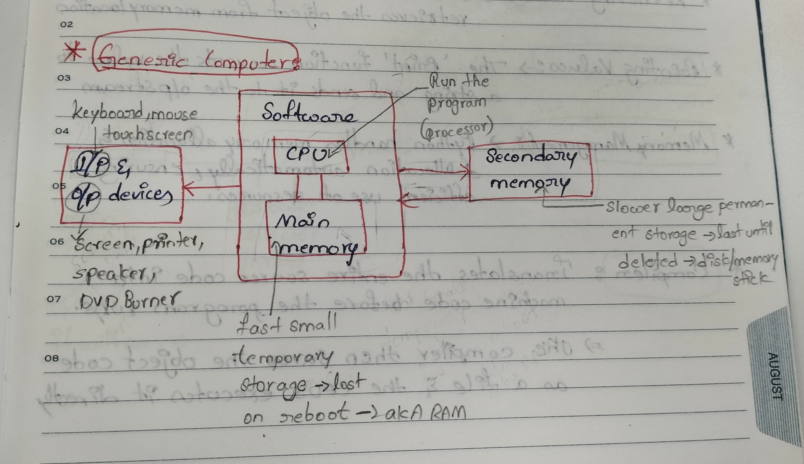

## Python:

* It is a high-level, general purpose programming language.
* It is dynamically typed and garbade collected.



Ex:
```
a=20     # here 'a' is reference  and '20' is object
b=30
c=a+b
print(c)
```
### Variable Assignment:

* Python creates an object for the value and stores it in memory.
* The variable name is the bound to the memory location where the object resides.

### Retrieving Values:

* When variable is accessed, python retrives the object from memory location.

### Printing Values:

* The 'print' function converts the value to a string and sends it to the o/p stream.

### Memory Management:

* Python handles memory management allocation and deallocation automatically, ensuring efficient use of resources.

### Compiler:

* Translates the entire source code into machine code before the program runs.
* The compiler then saves the object code as a file and the CPU's executes it directly.

### Interpreter:

* It translates the code line-by-line, without saving it.

### Operating System:(Threads)

* An OS is a software that controls and runs everathing on our computer.
* Python VM will take procresses, VM will interact with processer(Hardware(RAM))
* **`Operating System`** ->  Process creates has **`two threads`**.
    * **`Main Thread`** - It will access space in RAM, 
    * **`Garbage Collector Thread`** - It deletess unused objects in RAM

### Object:

* Object is specifications which consistes of ID, Value, Reference count and Type.

    `Object: ID / Reference Count / Value / Type`

### Process:

* It is a task allocating and runs in computer

### References and the Rules:

**Rules**:

1) Reference name should be userfriendly. To understand the code for future reference by watching code. 
2) Should not give space in Reference name.

### Memory 

### Type casting:

* Casting, also known as type conversion, is a process that converts a variable's data type into another data type.
* These conversions can be **`implicit`** (automatically interpreted) or **`explicit`** (using built-in functions).
